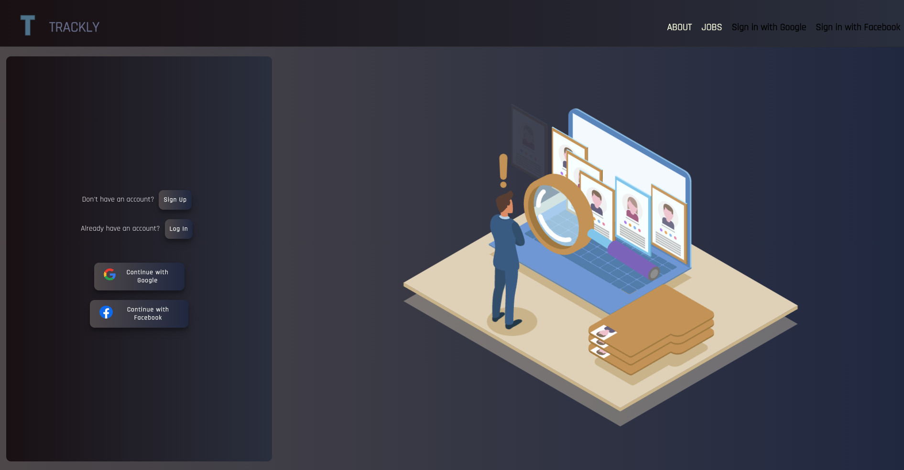

# Trackly

Trackly is a job management application that allows you to keep track of your job applications. You can create, update, and delete job postings.

Check the website here:
Netlify - <a href="https://legendary-halva-8abb3f.netlify.app/" target="_blank"><span style="font-family:Source Code Pro">Trackly</span></a>

<details>
<summary> Table of contents</summary>
<li><a href="#features">Features</a></li>
<li><a href="#technologies-used">Technologies Used</a></li>
<li><a href="#screenshots">Screenshots</a></li>
<li><a href="#resources">Resources</a></li>
<li><a href="#installation">Installation</a></li>
<li><a href="#future-enhancements">Future Enhancements</a></li>
<li><a href="#stay-in-touch">Stay In Touch</a></li>
</details>

## Features

- View a list of all jobs
- Create a new job posting
- Update job details
- Delete a job posting

<div align="right">
    <a href="#top">🔝</a>
</div>

---

## Technologies Used

<p align="center">
  <a href="https://skillicons.dev">
    
  </a>
</p>


### Backend Deployment
<p align="center">


</p>

<div align="right">
    <a href="#top">🔝</a>
</div>

---

## Screenshots




<div align="right">
    <a href="#top">🔝</a>
</div>

---

## Resources

- <a href="https://cssgradient.io/" target="_blank"><span>cssgradient.io</span></a>
- <a href="https://flaticon.com/" target="_blank"><span>flaticon.com</span></a>
- <a href="https://lottiefiles.com/" target="_blank"><span>lottiefiles.com</span></a>
- <a href="https://fonts.google.com/" target="_blank"><span>fonts.google.com</span></a>

<div align="right">
    <a href="#top">🔝</a>
</div>

---
  

## Installation

1. Clone the repository:

   ```shell
   git clone https://github.com/Arjybltrn/frontend-trackly.git
2. Navigate to the project directory:

   ```shell
   cd trackly
3. Install dependencies:

   ```shell
   npm start

<div align="right">
    <a href="#top">🔝</a>
</div>

---
## API Endpoints
- GET /jobs - Retrieve a list of all jobs.
- POST /jobs - Create a new job.
- PUT /jobs/:id - Update a job by ID.
- DELETE /jobs/:id - Delete a job by ID.


<div align="right">
    <a href="#top">🔝</a>
</div>

---


## Future Enhancements

- Ability to bookmark or save a job
- Ability to add link to the job posting
- Track where the job listing was posted


<div align="right">
    <a href="#top">🔝</a>
</div>

---

## Stay in touch
[![LinkedIn][linkedin-img]][linkedin-url]<br>
[![GitHub][github-img]][github-url]<br>


<div align="right">
    <a href="#top">🔝</a>
</div>


[github-img]: https://img.shields.io/badge/GitHub-100000?style=for-the-badge&logo=github&logoColor=white

[github-url]: https://github.com/Arjybltrn

[linkedin-img]: https://img.shields.io/badge/LinkedIn-0077B5?style=for-the-badge&logo=linkedin&logoColor=white

[linkedin-url]: https://www.linkedin.com/in/arjaybeltran/